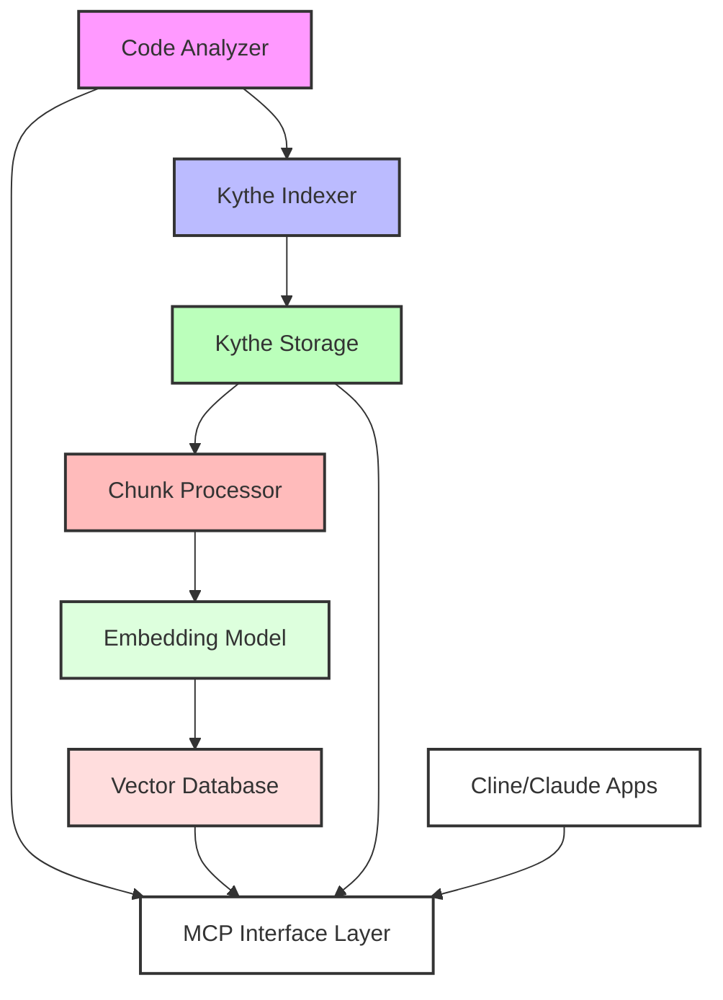

# Technical Design: Hybrid Kythe-Vector Database Approach

## 1. Overview

This design document outlines a hybrid architecture that leverages Kythe's robust code analysis capabilities for intelligent code chunking and structural understanding, combined with a vector database for semantic search and LLM integration. This approach combines the best of both worlds: Kythe's deep code understanding with vector databases' natural LLM compatibility.

## 2. System Architecture

### 2.1 High-Level Components



### 2.2 Component Descriptions

1. **Code Analyzer**
   - Coordinates analysis workflow
   - Manages language extractors
   - Handles incremental updates
   - Maintains metadata

2. **Kythe Indexer**
   - Uses Kythe's language extractors
   - Generates semantic graph
   - Maintains cross-references
   - Analyzes code structure

3. **Kythe Storage**
   - Stores code relationships
   - Manages semantic graph
   - Provides structural queries
   - Enables cross-references

4. **Chunk Processor**
   - Uses Kythe's semantic understanding
   - Creates intelligent chunks
   - Preserves context
   - Maintains relationships

5. **Embedding Model**
   - Generates embeddings
   - Uses code-specific models
   - Handles multiple languages
   - Preserves semantics

6. **Vector Database**
   - Stores code embeddings
   - Enables similarity search
   - Links to Kythe entities
   - Manages versioning

## 3. Intelligent Chunking Strategy

### 3.1 Kythe-Driven Chunking

1. **Semantic Boundaries**
   - Class definitions
   - Method implementations
   - Logical code blocks
   - Documentation sections

2. **Context Preservation**
   - Import statements
   - Class hierarchies
   - Method signatures
   - Type information

3. **Reference Tracking**
   - Symbol definitions
   - Cross-references
   - Dependencies
   - Usage patterns

### 3.2 Chunk Enhancement

1. **Metadata Enrichment**
   ```typescript
   interface EnhancedChunk {
     id: string;
     content: string;
     kytheData: {
       semanticKind: string;
       references: Reference[];
       definitions: Definition[];
       context: string;
     };
     metadata: {
       path: string;
       language: string;
       type: string;
     };
   }
   ```

2. **Context Windows**
   - Semantic boundaries
   - Related definitions
   - Usage context
   - Type information

## 4. Integration Pipeline

### 4.1 Analysis Flow


### 4.2 Data Flow

1. **Kythe Analysis**
   - Language extraction
   - Semantic analysis
   - Cross-referencing
   - Graph generation

2. **Chunk Generation**
   - Semantic boundary detection
   - Context gathering
   - Reference collection
   - Metadata enrichment

3. **Vector Processing**
   - Embedding generation
   - Similarity indexing
   - Reference linking
   - Context preservation

## 5. Query Capabilities

### 5.1 Hybrid Queries

1. **Combined Search**
   ```typescript
   interface HybridQuery {
     semantic: {
       query: string;
       threshold: number;
     };
     structural: {
       kind: string;
       references: boolean;
     };
   }
   ```

2. **Enhanced Results**
   ```typescript
   interface HybridResult {
     content: string;
     similarity: number;
     structure: {
       kind: string;
       references: Reference[];
       context: string;
     };
     metadata: {
       path: string;
       language: string;
     };
   }
   ```

### 5.2 Query Types

1. **Semantic Queries**
   - Natural language search
   - Concept matching
   - Similar code finding
   - Pattern recognition

2. **Structural Queries**
   - Definition finding
   - Reference tracking
   - Dependency analysis
   - Type relationships

3. **Combined Queries**
   - Semantic + structural
   - Context-aware search
   - Relationship-based filtering
   - Enhanced ranking

## 6. MCP Integration

### 6.1 Tools

1. **Hybrid Search**
   ```typescript
   interface HybridSearchTool {
     query: string;
     semanticThreshold?: number;
     includeStructure?: boolean;
     limit?: number;
   }
   ```

2. **Context Analysis**
   ```typescript
   interface ContextTool {
     target: string;
     includeReferences?: boolean;
     includeSemantics?: boolean;
     depth?: number;
   }
   ```

3. **Code Understanding**
   ```typescript
   interface UnderstandTool {
     path: string;
     mode: "semantic" | "structural" | "hybrid";
     detail: "high" | "medium" | "low";
   }
   ```

### 6.2 Resources

1. **Code Resources**
   - URI: `hybrid://{path}/{type}`
   - Examples:
     - `hybrid://src/main/MyClass/semantic`
     - `hybrid://src/main/MyClass/structural`

2. **Analysis Resources**
   - URI: `analysis://{path}/{kind}`
   - Examples:
     - `analysis://src/main/MyClass/context`
     - `analysis://src/main/MyClass/references`

## 7. Advantages

1. **Intelligent Chunking**
   - Semantically meaningful chunks
   - Preserved relationships
   - Rich context
   - Accurate boundaries

2. **Enhanced Understanding**
   - Deep code analysis
   - Semantic search
   - Structural awareness
   - Complete context

3. **Flexible Querying**
   - Combined approaches
   - Rich metadata
   - Multiple perspectives
   - Better results

4. **Optimal Integration**
   - Best of both worlds
   - Rich capabilities
   - Natural LLM interface
   - Comprehensive analysis

## 8. Implementation Strategy

### 8.1 Phase 1: Foundation

1. **Kythe Setup**
   - Install toolchain
   - Configure extractors
   - Setup storage
   - Test analysis

2. **Vector Integration**
   - Choose database
   - Setup infrastructure
   - Configure embeddings
   - Test storage

### 8.2 Phase 2: Integration

1. **Chunking Pipeline**
   - Implement chunking
   - Add context
   - Preserve references
   - Test accuracy

2. **Query System**
   - Build hybrid queries
   - Implement ranking
   - Optimize results
   - Test performance

### 8.3 Phase 3: Enhancement

1. **Advanced Features**
   - Rich context
   - Deep analysis
   - Enhanced search
   - Performance optimization

2. **MCP Tools**
   - Implement tools
   - Add resources
   - Test integration
   - Document usage

## 9. Conclusion

This hybrid approach combines Kythe's deep code understanding with vector databases' LLM-friendly capabilities. By using Kythe for intelligent chunking and structural analysis, we ensure high-quality, semantically meaningful code segments. The vector database then enables natural language queries and semantic search, creating a powerful system that offers both structural accuracy and intuitive LLM interaction.
