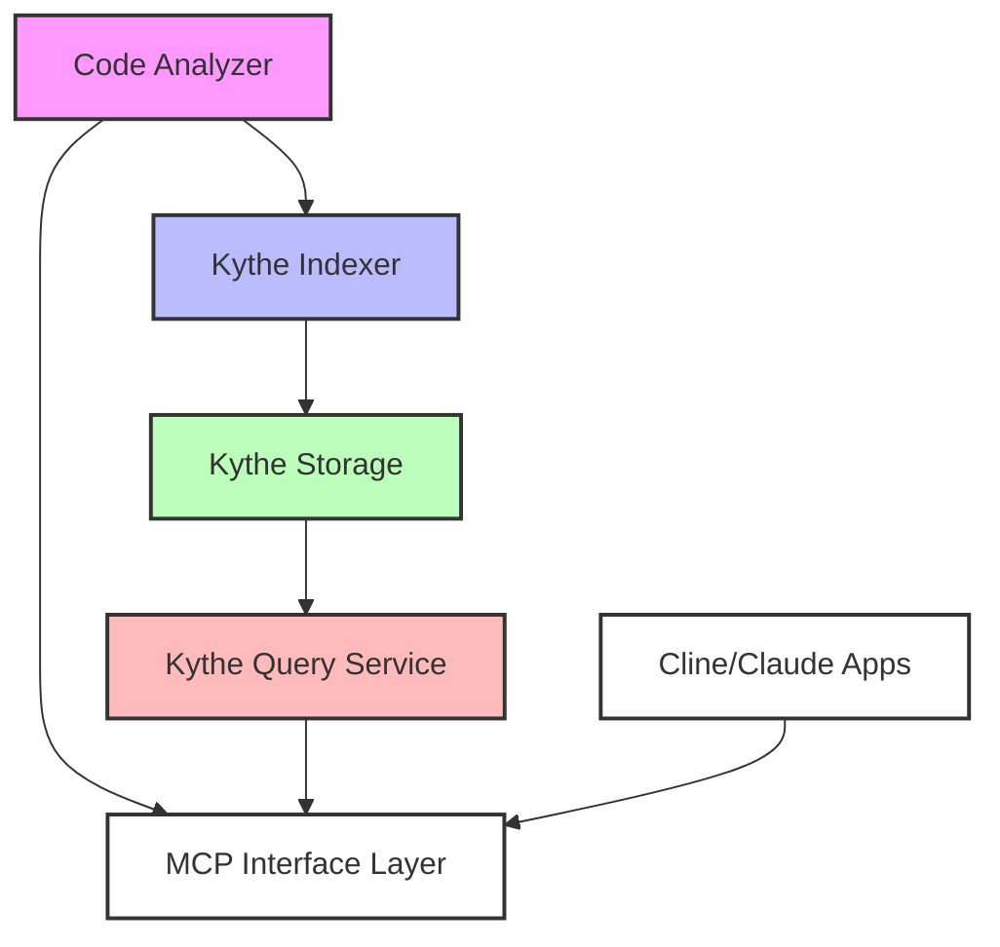

# Technical Design: Kythe-Based Code Analysis MCP Plugin

## 1. Overview

This design document outlines the architecture for integrating Kythe as the core indexing and querying engine for our code analysis MCP plugin. Kythe provides a robust, language-agnostic system for code indexing, cross-referencing, and semantic analysis that aligns well with our requirements.

## 2. System Architecture

### 2.1 High-Level Components



### 2.2 Component Descriptions

1. **Code Analyzer**
   - Coordinates analysis process
   - Manages language-specific extractors
   - Handles incremental updates
   - Processes documentation and comments

2. **Kythe Indexer**
   - Uses Kythe's language-specific extractors
   - Generates Kythe graph entries
   - Maintains cross-references
   - Captures semantic information

3. **Kythe Storage**
   - Stores indexed code data
   - Manages graph relationships
   - Provides efficient lookup
   - Handles versioning

4. **Kythe Query Service**
   - Executes semantic queries
   - Provides cross-references
   - Supports relationship traversal
   - Enables documentation lookup

5. **MCP Interface Layer**
   - Exposes Kythe capabilities via MCP
   - Translates queries to Kythe format
   - Handles response formatting
   - Manages error handling

## 3. Integration with Kythe

### 3.1 Kythe Core Concepts

1. **Nodes**
   - VNames (versioned names) for unique identification
   - Facts for storing properties
   - Edges for relationships
   - Subkind classification

2. **Graph Structure**
   - Anchor nodes for source locations
   - Abstract nodes for semantic entities
   - Edge kinds for relationship types
   - Fact labels for properties

### 3.2 Language Support

1. **Built-in Extractors**
   - Java (via javac plugin)
   - Go
   - C++
   - TypeScript/JavaScript
   - Python (experimental)

2. **Custom Extractors**
   - Framework for new languages
   - Protocol buffer interface
   - Compilation tracking
   - Incremental analysis

### 3.3 Analysis Pipeline

1. **Extraction Phase**
   ```mermaid
   flowchart LR
       SC[Source Code] --> LE[Language Extractor]
       LE --> KF[Kythe Facts]
       KF --> KG[Kythe Graph]
   ```

2. **Storage Phase**
   ```mermaid
   flowchart LR
       KF[Kythe Facts] --> KDB[Kythe Database]
       KDB --> KS[Serving Table]
   ```

3. **Query Phase**
   ```mermaid
   flowchart LR
       KS[Serving Table] --> KQ[Query Service]
       KQ --> API[GraphQL/REST API]
   ```

## 4. MCP Integration

### 4.1 Tools

1. **Code Structure Tools**
   ```typescript
   interface CodeStructureQuery {
     path: string;
     kind: "class" | "method" | "package";
     includeRefs: boolean;
   }
   ```

2. **Reference Tools**
   ```typescript
   interface ReferenceQuery {
     target: string;
     kind: "definition" | "usage" | "implementation";
     limit?: number;
   }
   ```

3. **Documentation Tools**
   ```typescript
   interface DocQuery {
     entity: string;
     format: "markdown" | "html";
     includeCrossRefs: boolean;
   }
   ```

### 4.2 Resources

1. **Code Resources**
   - URI Template: `code://{path}/{type}`
   - Examples:
     - `code://src/main/MyClass/structure`
     - `code://src/main/MyClass/references`

2. **Documentation Resources**
   - URI Template: `docs://{path}/{format}`
   - Examples:
     - `docs://src/main/MyClass/markdown`
     - `docs://src/main/MyClass/html`

## 5. Query Capabilities

### 5.1 Semantic Queries

1. **Definition Finding**
   - Find all definitions of a symbol
   - Get declaration locations
   - Resolve overrides/implementations

2. **Reference Analysis**
   - Find all references to a symbol
   - Get usage contexts
   - Track dependencies

3. **Type Analysis**
   - Resolve type hierarchies
   - Find implementations
   - Check type relationships

### 5.2 Documentation Queries

1. **API Documentation**
   - Extract formatted documentation
   - Get parameter descriptions
   - Find usage examples

2. **Cross References**
   - Link related documentation
   - Find similar APIs
   - Get usage patterns

## 6. Performance Considerations

### 6.1 Indexing Performance

1. **Parallel Processing**
   - Multiple language extractors
   - Concurrent file processing
   - Distributed indexing support

2. **Incremental Updates**
   - Change detection
   - Partial reindexing
   - Cache invalidation

### 6.2 Query Performance

1. **Caching Strategy**
   - Query result caching
   - Serving table optimization
   - Memory-mapped storage

2. **Query Optimization**
   - Path compression
   - Index utilization
   - Result streaming

## 7. Migration Strategy

### 7.1 Phase 1: Setup

1. **Infrastructure**
   - Install Kythe toolchain
   - Configure language extractors
   - Setup serving tables

2. **Data Migration**
   - Export Neo4j data
   - Transform to Kythe format
   - Validate conversion

### 7.2 Phase 2: Integration

1. **Code Changes**
   - Update MCP interface
   - Modify query handlers
   - Adapt documentation processing

2. **Testing**
   - Verify data integrity
   - Benchmark performance
   - Validate functionality

### 7.3 Phase 3: Deployment

1. **Rollout**
   - Gradual feature migration
   - Parallel running period
   - Performance monitoring

2. **Validation**
   - Feature parity checks
   - Performance comparison
   - User acceptance testing

## 8. Advantages Over Neo4j

1. **Language Support**
   - Built-in support for major languages
   - Standard extraction protocol
   - Consistent semantic model

2. **Scalability**
   - Designed for large codebases
   - Efficient storage format
   - Optimized query performance

3. **Semantic Analysis**
   - Rich cross-referencing
   - Deep semantic understanding
   - Standard documentation format

4. **Community Support**
   - Active development
   - Multiple implementations
   - Proven at scale (Google)
