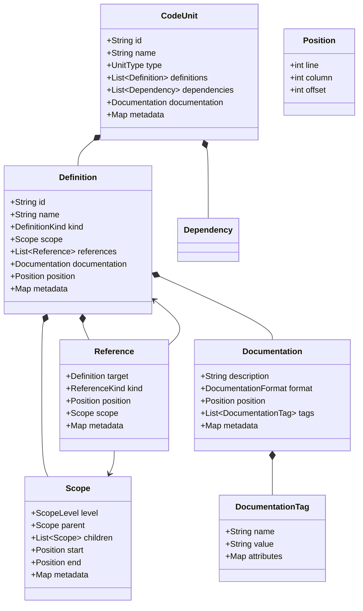

# Language-Agnostic Code Model

This document describes the core abstractions used to represent code across different programming languages.

## Model Overview

## Component Descriptions

### Core Elements

- **CodeUnit**: Represents a unit of code organization like a file, module, or namespace. Serves as the top-level container for code elements.

- **Definition**: Represents any named entity in code (function, type, variable, etc). The primary building block for representing code structure.

### Relationships and References

- **Reference**: Represents any usage or mention of a definition in code. Captures relationships between different parts of the code.

- **Scope**: Represents the visibility and accessibility context of definitions. Models nested scoping rules found in most languages.

### Documentation

- **Documentation**: Represents comments and documentation attached to code elements. Supports different documentation formats and styles.

- **DocumentationTag**: Represents structured documentation elements like @param or @return. Enables parsing and analysis of documentation.

### Supporting Types

- **Position**: Represents a location in source code using line, column, and character offset. Used for precise source mapping.

### Enums

- **UnitType**: FILE, MODULE, NAMESPACE, PACKAGE, LIBRARY, OTHER
- **DefinitionKind**: FUNCTION, TYPE, VARIABLE, MODULE, PROPERTY, PARAMETER, OTHER
- **ReferenceKind**: USE, MODIFY, EXTEND, IMPLEMENT, IMPORT, OTHER
- **ScopeLevel**: GLOBAL, PACKAGE, TYPE, FUNCTION, BLOCK, OTHER
- **DocumentationFormat**: PLAIN_TEXT, MARKDOWN, JAVADOC, JSDOC, DOCSTRING, OTHER

## Design Principles

1. **Language Agnostic**: All abstractions are designed to work across different programming languages and paradigms.

2. **Extensible**: The model uses maps for metadata to allow language-specific extensions without modifying core interfaces.

3. **Complete**: Captures all essential aspects of code: structure, relationships, documentation, and source locations.

4. **Precise**: Maintains exact source positions and relationships for accurate analysis and transformation.

5. **Flexible**: Supports both object-oriented and functional programming concepts through generic abstractions.
