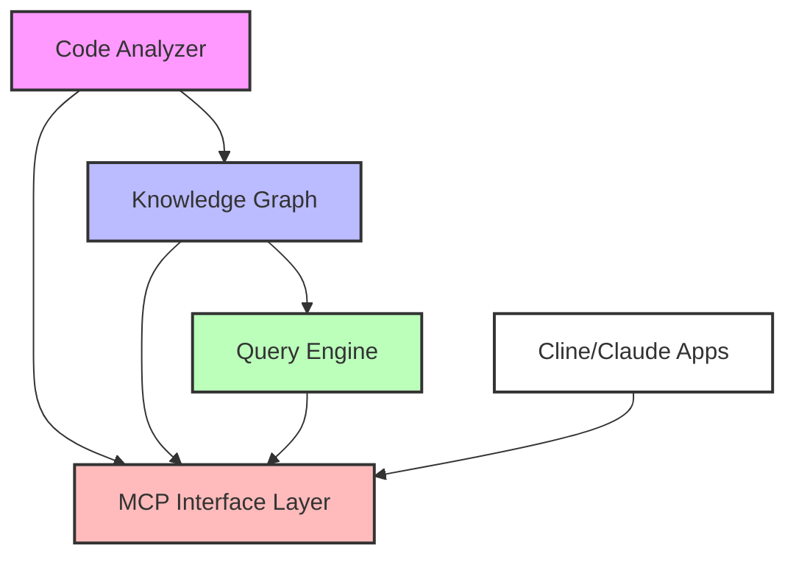

# Technical Design: Code Analysis MCP Plugin

## 1. System Architecture

### 1.1 High-Level Components



### 1.2 Component Descriptions

1. **Code Analyzer**

   - Language-specific parsers for code analysis
   - AST (Abstract Syntax Tree) generators
   - Metrics calculators
   - Documentation extractors

2. **Knowledge Graph**

   - Graph database (Neo4j recommended)
   - Entity manager
   - Relationship manager
   - Update manager

3. **Query Engine**

   - Natural language query parser
   - Graph traversal engine
   - Response formatter
   - Cache manager

4. **MCP Interface Layer**
   - Tool and resource registration
   - Request handling
   - Response formatting
   - Error handling

## 2. Knowledge Graph Schema

### 2.1 Node Types

```
[File]
- path: string
- language: string
- lastModified: timestamp
- size: number

[Class]
- name: string
- visibility: string
- abstract: boolean
- metrics: {
    complexity: number,
    cohesion: number,
    coupling: number
  }

[Method]
- name: string
- visibility: string
- static: boolean
- metrics: {
    complexity: number,
    length: number,
    parameters: number
  }

[Variable]
- name: string
- type: string
- visibility: string
- static: boolean

[Documentation]
- content: string
- type: enum (comment, docstring, markdown)
- language: string
```

### 2.2 Relationship Types

```
(File)-[:CONTAINS]->(Class)
(File)-[:IMPORTS]->(File)
(Class)-[:EXTENDS]->(Class)
(Class)-[:IMPLEMENTS]->(Interface)
(Class)-[:CONTAINS]->(Method)
(Class)-[:CONTAINS]->(Variable)
(Method)-[:CALLS]->(Method)
(Method)-[:USES]->(Variable)
(Method)-[:RETURNS]->(Type)
(Documentation)-[:DESCRIBES]->(Node)
```

## 3. Component Specifications

### 3.1 Code Analyzer

#### Language Support

- Initial support: JavaScript/TypeScript, Python, Java
- Extensible architecture for adding new languages
- Language-specific parser plugins

#### Analysis Features

```typescript
interface CodeAnalyzer {
  parseFile(path: string): Promise<AST>;
  extractMetrics(ast: AST): CodeMetrics;
  extractRelationships(ast: AST): Relationships[];
  extractDocumentation(ast: AST): Documentation[];
}

interface CodeMetrics {
  complexity: number;
  cohesion: number;
  coupling: number;
  lineCount: number;
  commentCount: number;
  // Additional metrics
}
```

### 3.2 Knowledge Graph Manager

#### Graph Operations

```typescript
interface GraphManager {
  addNode(type: NodeType, properties: Properties): Promise<Node>;
  addRelationship(
    from: Node,
    to: Node,
    type: RelationType
  ): Promise<Relationship>;
  updateNode(node: Node, properties: Properties): Promise<Node>;
  deleteNode(node: Node): Promise<void>;
  query(query: GraphQuery): Promise<QueryResult>;
}
```

### 3.3 Query Engine

#### Query Types

```typescript
interface QueryEngine {
  parseNaturalLanguage(query: string): StructuredQuery;
  executeQuery(query: StructuredQuery): Promise<QueryResult>;
  formatResponse(result: QueryResult): FormattedResponse;
}

type QueryType =
  | "SUMMARY"
  | "ARCHITECTURE"
  | "COMPONENT"
  | "QUALITY"
  | "RELATIONSHIP";
```

## 4. Implementation Plan

### 4.1 Phase 1: Core Infrastructure

1. Set up Neo4j graph database
2. Implement basic MCP interface
3. Create core analyzer for JavaScript/TypeScript
4. Implement basic query engine

### 4.2 Phase 2: Enhanced Analysis

1. Add support for Python and Java
2. Implement advanced metrics
3. Add documentation analysis
4. Enhance relationship detection

### 4.3 Phase 3: Advanced Features

1. Implement caching layer
2. Add real-time update capabilities
3. Enhance natural language processing
4. Add visualization capabilities

## 5. API Specifications

### 5.1 MCP Tools

```typescript
interface MCPTools {
  analyzeCodebase: {
    input: {
      path: string;
      languages?: string[];
      excludePaths?: string[];
    };
    output: {
      status: "success" | "error";
      metrics?: CodebaseMetrics;
      error?: string;
    };
  };

  query: {
    input: {
      query: string;
      context?: QueryContext;
    };
    output: {
      result: QueryResult;
      confidence: number;
    };
  };

  getMetrics: {
    input: {
      path?: string;
      type?: "file" | "class" | "method";
    };
    output: {
      metrics: Metrics[];
    };
  };
}
```

### 5.2 MCP Resources

```typescript
interface MCPResources {
  codebase: {
    uri: "codebase://summary";
    type: "json";
  };

  metrics: {
    uri: "codebase://metrics/{path}";
    type: "json";
  };

  documentation: {
    uri: "codebase://docs/{path}";
    type: "markdown";
  };
}
```

## 6. Performance Considerations

### 6.1 Optimization Strategies

1. **Incremental Updates**

   - Track file changes using checksums
   - Update only modified components
   - Maintain relationship cache

2. **Query Optimization**

   - Implement query result caching
   - Use graph traversal optimization
   - Index frequently accessed nodes

3. **Memory Management**
   - Implement lazy loading for large components
   - Use streaming for large file processing
   - Implement garbage collection for outdated data

### 6.2 Scalability Considerations

1. **Large Codebases**

   - Parallel processing for analysis
   - Distributed graph storage
   - Sharding strategies

2. **Concurrent Access**
   - Read/write locks
   - Transaction management
   - Version control integration

## 7. Error Handling

### 7.1 Error Categories

1. **Analysis Errors**

   - Parsing failures
   - Unsupported language features
   - Invalid file formats

2. **Graph Errors**

   - Database connection issues
   - Transaction failures
   - Constraint violations

3. **Query Errors**
   - Invalid query format
   - Timeout issues
   - Resource constraints

### 7.2 Error Recovery

1. **Automatic Recovery**

   - Retry mechanisms
   - Fallback strategies
   - Auto-healing procedures

2. **Manual Intervention**
   - Error logging
   - Administrative tools
   - Recovery procedures

## 8. Security Considerations

1. **Access Control**

   - Role-based access
   - Authentication integration
   - Audit logging

2. **Data Protection**
   - Encryption at rest
   - Secure communication
   - Data sanitization

## 9. Testing Strategy

### 9.1 Test Categories

1. **Unit Tests**

   - Component-level testing
   - Mock integration points
   - Error handling verification

2. **Integration Tests**

   - Cross-component testing
   - Database integration
   - API verification

3. **Performance Tests**
   - Load testing
   - Scalability testing
   - Resource utilization

### 9.2 Test Implementation

```typescript
describe("CodeAnalyzer", () => {
  it("should parse JavaScript files correctly", async () => {
    const analyzer = new CodeAnalyzer();
    const ast = await analyzer.parseFile("example.js");
    expect(ast).toHaveValidStructure();
  });
});

describe("QueryEngine", () => {
  it("should handle natural language queries", async () => {
    const engine = new QueryEngine();
    const result = await engine.query(
      "Show me all classes with high complexity"
    );
    expect(result).toContainComplexityMetrics();
  });
});
```

## 10. Deployment Considerations

### 10.1 Requirements

1. **System Requirements**

   - Neo4j database
   - Node.js runtime
   - Language-specific toolchains
   - Sufficient storage and memory

2. **Configuration**
   - Environment variables
   - Database connection
   - Language support
   - Cache settings

### 10.2 Installation Process

1. Install dependencies
2. Configure database
3. Set up language analyzers
4. Configure MCP integration
5. Initialize knowledge graph
6. Verify installation

## 11. Maintenance and Updates

1. **Regular Maintenance**

   - Database optimization
   - Cache cleanup
   - Log rotation
   - Metric recalculation

2. **Update Procedures**
   - Schema migrations
   - API version management
   - Backward compatibility
   - Rollback procedures
