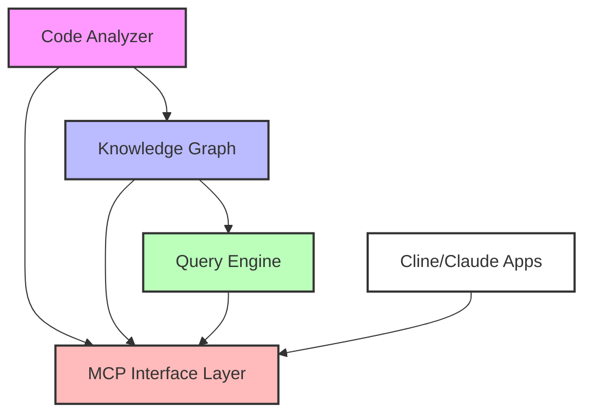

# Technical Design: Code Analysis MCP Plugin

## 1. System Architecture

### 1.1 High-Level Components



### 1.2 Component Descriptions

1. **Code Analyzer**

   - Language-specific parsers for code analysis
   - AST (Abstract Syntax Tree) generators
   - Metrics calculators
   - Documentation extractors

2. **Knowledge Graph**

   - Graph database (Neo4j recommended)
   - Entity manager
   - Relationship manager
   - Update manager

3. **Query Engine**

   - Natural language query parser
   - Graph traversal engine
   - Response formatter
   - Cache manager

4. **MCP Interface Layer**
   - Tool and resource registration
   - Request handling
   - Response formatting
   - Error handling

## 2. Knowledge Graph Schema

### 2.1 Node Types

```
[Component]
- name: string
- description: string
- documentation: {
    inline: string,          // Documentation from code comments
    markdown: string,        // Documentation from markdown files
    llmGenerated: string,    // LLM-generated documentation
    lastUpdated: timestamp
  }
- metrics: {
    cohesion: number,
    coupling: number
  }

[File]
- path: string
- language: string
- lastModified: timestamp
- size: number
- documentation: {
    inline: string,          // Documentation from code comments
    markdown: string,        // Documentation from markdown files
    llmGenerated: string,    // LLM-generated documentation
    lastUpdated: timestamp
  }

[Class]
- name: string
- visibility: string
- abstract: boolean
- documentation: {
    inline: string,          // Documentation from code comments
    markdown: string,        // Documentation from markdown files
    llmGenerated: string,    // LLM-generated documentation
    lastUpdated: timestamp
  }
- metrics: {
    complexity: number,
    cohesion: number,
    coupling: number
  }

[Method]
- name: string
- visibility: string
- static: boolean
- documentation: {
    inline: string,          // Documentation from code comments
    markdown: string,        // Documentation from markdown files
    llmGenerated: string,    // LLM-generated documentation
    lastUpdated: timestamp
  }
- metrics: {
    complexity: number,
    length: number,
    parameters: number
  }

[Variable]
- name: string
- type: string
- visibility: string
- static: boolean
- documentation: {
    inline: string,          // Documentation from code comments
    llmGenerated: string,    // LLM-generated documentation
    lastUpdated: timestamp
  }
```

### 2.2 Relationship Types

```
(Component)-[:CONTAINS]->(Component)    // Hierarchical component structure
(Component)-[:CONTAINS]->(File)         // Files in a component
(Component)-[:DEPENDS_ON]->(Component)  // Component dependencies

(File)-[:CONTAINS]->(Class)
(File)-[:IMPORTS]->(File)
(File)-[:BELONGS_TO]->(Component)

(Class)-[:EXTENDS]->(Class)
(Class)-[:IMPLEMENTS]->(Interface)
(Class)-[:CONTAINS]->(Method)
(Class)-[:CONTAINS]->(Variable)
(Class)-[:BELONGS_TO]->(Component)

(Method)-[:CALLS]->(Method)
(Method)-[:USES]->(Variable)
(Method)-[:RETURNS]->(Type)
```

## 3. Component Specifications

### 3.1 Code Analyzer

#### Language Support

- Initial support: Java
- Future support: Python, JavaScript/TypeScript
- Extensible architecture for adding new languages
- Language-specific parser plugins

#### Analysis Features

```java
public interface CodeAnalyzer {
    AST parseFile(Path path) throws IOException;
    CodeMetrics extractMetrics(AST ast);
    List<Relationship> extractRelationships(AST ast);
    List<Documentation> extractDocumentation(AST ast);
}

public interface CodeMetrics {
    int getComplexity();
    double getCohesion();
    double getCoupling();
    int getLineCount();
    int getCommentCount();
    // Additional metrics
}
```

### 3.2 Knowledge Graph Manager

#### Graph Operations

```java
public interface GraphManager {
    Node addNode(NodeType type, Map<String, Object> properties);
    Relationship addRelationship(Node from, Node to, RelationType type);
    Node updateNode(Node node, Map<String, Object> properties);
    void deleteNode(Node node);
    QueryResult query(GraphQuery query);
}
```

### 3.3 Query Engine

#### Query Types

```java
public interface QueryEngine {
    StructuredQuery parseNaturalLanguage(String query);
    QueryResult executeQuery(StructuredQuery query);
    FormattedResponse formatResponse(QueryResult result);
}

public enum QueryType {
    SUMMARY,
    ARCHITECTURE,
    COMPONENT,
    QUALITY,
    RELATIONSHIP
}
```

## 4. Implementation Plan

### 4.1 Phase 1: Core Infrastructure

1. Set up Neo4j graph database
2. Implement basic MCP interface
3. Create core analyzer for Java using JavaParser
4. Implement basic query engine with Neo4j Java driver

### 4.2 Phase 2: Enhanced Analysis

1. Add support for Python and Java
2. Implement advanced metrics
3. Add documentation analysis
4. Enhance relationship detection

### 4.3 Phase 3: Advanced Features

1. Implement caching layer
2. Add real-time update capabilities
3. Enhance natural language processing
4. Add visualization capabilities

## 5. API Specifications

### 5.1 MCP Tools

```java
public interface MCPTools {
    public record AnalyzeInput(
        String path,
        Optional<List<String>> languages,
        Optional<List<String>> excludePaths
    ) {}

    public record AnalyzeOutput(
        Status status,
        Optional<CodebaseMetrics> metrics,
        Optional<String> error
    ) {}

    public record QueryInput(
        String query,
        Optional<QueryContext> context
    ) {}

    public record QueryOutput(
        QueryResult result,
        double confidence
    ) {}

    public record MetricsInput(
        Optional<String> path,
        Optional<EntityType> type
    ) {}

    public record MetricsOutput(
        List<Metrics> metrics
    ) {}

    AnalyzeOutput analyzeCodebase(AnalyzeInput input);
    QueryOutput query(QueryInput input);
    MetricsOutput getMetrics(MetricsInput input);
}

public enum Status {
    SUCCESS, ERROR
}

public enum EntityType {
    FILE, CLASS, METHOD
}
```

### 5.2 MCP Resources

```java
public interface MCPResources {
    public record Resource(String uri, String type) {}

    Resource CODEBASE = new Resource("codebase://summary", "json");
    Resource METRICS = new Resource("codebase://metrics/{path}", "json");
    Resource DOCUMENTATION = new Resource("codebase://docs/{path}", "markdown");
}
```

## 6. Performance Considerations

### 6.1 Optimization Strategies

1. **Incremental Updates**

   - Track file changes using checksums
   - Update only modified components
   - Maintain relationship cache

2. **Query Optimization**

   - Implement query result caching
   - Use graph traversal optimization
   - Index frequently accessed nodes

3. **Memory Management**
   - Implement lazy loading for large components
   - Use streaming for large file processing
   - Implement garbage collection for outdated data

### 6.2 Scalability Considerations

1. **Large Codebases**

   - Parallel processing for analysis
   - Distributed graph storage
   - Sharding strategies

2. **Concurrent Access**
   - Read/write locks
   - Transaction management
   - Version control integration

## 7. Error Handling

### 7.1 Error Categories

1. **Analysis Errors**

   - Parsing failures
   - Unsupported language features
   - Invalid file formats

2. **Graph Errors**

   - Database connection issues
   - Transaction failures
   - Constraint violations

3. **Query Errors**
   - Invalid query format
   - Timeout issues
   - Resource constraints

### 7.2 Error Recovery

1. **Automatic Recovery**

   - Retry mechanisms
   - Fallback strategies
   - Auto-healing procedures

2. **Manual Intervention**
   - Error logging
   - Administrative tools
   - Recovery procedures

## 8. Security Considerations

1. **Access Control**

   - Role-based access
   - Authentication integration
   - Audit logging

2. **Data Protection**
   - Encryption at rest
   - Secure communication
   - Data sanitization

## 9. Testing Strategy

### 9.1 Test Categories

1. **Unit Tests**

   - Component-level testing
   - Mock integration points
   - Error handling verification

2. **Integration Tests**

   - Cross-component testing
   - Database integration
   - API verification

3. **Performance Tests**
   - Load testing
   - Scalability testing
   - Resource utilization

### 9.2 Test Implementation

```java
@Test
class CodeAnalyzerTest {
    @Test
    void shouldParseJavaFilesCorrectly() throws IOException {
        CodeAnalyzer analyzer = new CodeAnalyzer();
        AST ast = analyzer.parseFile(Path.of("Example.java"));
        assertThat(ast).hasValidStructure();
    }
}

@Test
class QueryEngineTest {
    @Test
    void shouldHandleNaturalLanguageQueries() {
        QueryEngine engine = new QueryEngine();
        QueryResult result = engine.query("Show me all classes with high complexity");
        assertThat(result).containsComplexityMetrics();
    }
}
```

## 10. Deployment Considerations

### 10.1 Requirements

1. **System Requirements**

   - Neo4j database
   - JDK 17 or higher
   - JavaParser library
   - Neo4j Java driver
   - Sufficient storage and memory

2. **Configuration**
   - Environment variables
   - Database connection
   - Language support
   - Cache settings

### 10.2 Installation Process

1. Install dependencies
2. Configure database
3. Set up language analyzers
4. Configure MCP integration
5. Initialize knowledge graph
6. Verify installation

## 11. Maintenance and Updates

1. **Regular Maintenance**

   - Database optimization
   - Cache cleanup
   - Log rotation
   - Metric recalculation

2. **Update Procedures**
   - Schema migrations
   - API version management
   - Backward compatibility
   - Rollback procedures
