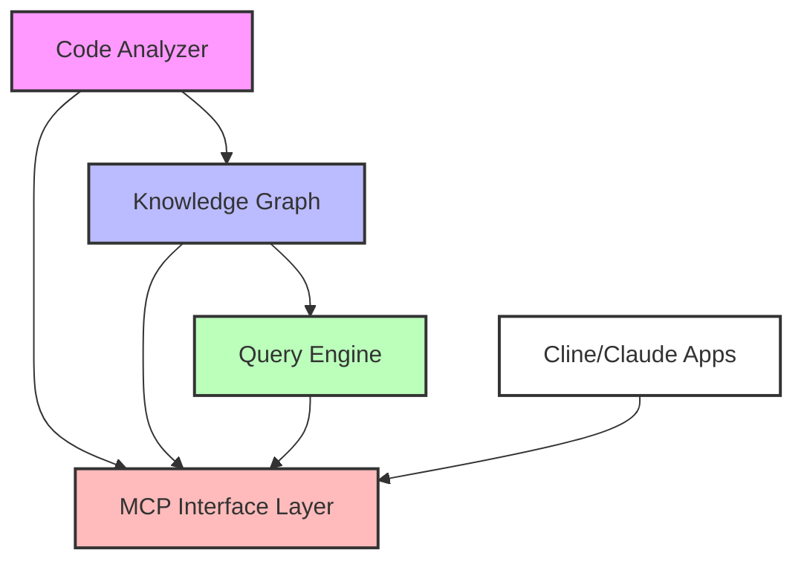

# Technical Design: Code Analysis MCP Plugin

## 1. System Architecture

### 1.1 High-Level Components

### 1.2 Component Descriptions

1. **Code Analyzer**
   - Parses source code into language-agnostic models
   - Extracts code structure and relationships
   - Analyzes code metrics and quality
   - Processes documentation and comments

2. **Knowledge Graph**
   - Stores code analysis results
   - Maintains relationships between code entities
   - Tracks code evolution over time
   - Enables efficient querying and traversal

3. **Query Engine**
   - Processes natural language queries
   - Traverses knowledge graph
   - Formats responses for clients
   - Manages query caching

4. **MCP Interface Layer**
   - Exposes analysis capabilities via MCP protocol
   - Handles client requests
   - Manages tool and resource registration
   - Provides error handling and recovery

## 2. Code Analysis Architecture

### 2.1 Language Support

The system is designed to support multiple programming languages through a modular architecture:

1. **Initial Support**
   - Java (primary focus)
   - Support for classes, interfaces, methods, and documentation

2. **Future Languages**
   - Python
   - JavaScript/TypeScript
   - Additional languages as needed

3. **Language-Agnostic Model**
   - Common representation for all languages
   - Unified handling of code structures
   - Consistent documentation format
   - Standard metrics calculations

### 2.2 Analysis Components

1. **Parser Layer**
   - Language-specific parsers
   - AST generation
   - Symbol resolution
   - Type inference

2. **Converter Layer**
   - Transforms language-specific ASTs to common model
   - Specialized converters for:
     * Classes and interfaces
     * Methods and constructors
     * Documentation and comments
   - Maintains language-specific context

3. **Model Layer**
   - Code units (files)
   - Definitions (classes, methods)
   - Documentation
   - Relationships
   - Metrics

4. **Analysis Layer**
   - Code quality metrics
   - Complexity calculations
   - Pattern detection
   - Best practice validation

### 2.3 Documentation Analysis

1. **Comment Processing**
   - Language-specific comment formats (Javadoc, JSDoc, etc.)
   - Markdown documentation
   - Inline comments
   - License and copyright information

2. **Documentation Features**
   - API documentation extraction
   - Code examples
   - Parameter descriptions
   - Return value documentation
   - Cross-references

### 2.4 Metrics and Analysis

1. **Code Metrics**
   - Complexity metrics
   - Size metrics
   - Documentation coverage
   - Test coverage

2. **Quality Analysis**
   - SOLID principles validation
   - Design pattern detection
   - Code smell identification
   - Best practice checking

## 3. Knowledge Graph Design

### 3.1 Node Types

1. **Component Nodes**
   - Name and description
   - Documentation
   - Metrics (cohesion, coupling)
   - Version information

2. **File Nodes**
   - Path and language
   - Last modified timestamp
   - Size and metrics
   - Documentation

3. **Class Nodes**
   - Name and visibility
   - Abstract/concrete status
   - Documentation
   - Quality metrics

4. **Method Nodes**
   - Name and visibility
   - Static/instance status
   - Documentation
   - Complexity metrics

5. **Variable Nodes**
   - Name and type
   - Visibility and scope
   - Documentation
   - Usage metrics

### 3.2 Relationships

1. **Structural Relationships**
   - Component hierarchy
   - File organization
   - Class membership
   - Method ownership

2. **Dependency Relationships**
   - Component dependencies
   - File imports
   - Class inheritance
   - Method calls

3. **Usage Relationships**
   - Variable access
   - Method invocation
   - Type references
   - Documentation links

## 4. Query Capabilities

### 4.1 Query Types

1. **Structural Queries**
   - Component organization
   - Class hierarchies
   - Method relationships
   - Variable usage

2. **Metric Queries**
   - Code complexity
   - Documentation coverage
   - Test coverage
   - Quality metrics

3. **Documentation Queries**
   - API documentation
   - Usage examples
   - Best practices
   - Design patterns

### 4.2 Query Features

1. **Natural Language Processing**
   - Query understanding
   - Context awareness
   - Relevance ranking
   - Result formatting

2. **Performance Optimization**
   - Query caching
   - Incremental updates
   - Parallel processing
   - Result streaming

## 5. Integration Features

### 5.1 MCP Integration

1. **Tools**
   - Code analysis
   - Documentation generation
   - Metric calculation
   - Quality assessment

2. **Resources**
   - Code summaries
   - Documentation access
   - Metric reports
   - Analysis results

### 5.2 Client Integration

1. **Cline Integration**
   - Code understanding
   - Documentation access
   - Quality insights
   - Refactoring suggestions

2. **Claude Desktop Integration**
   - Direct code queries
   - Documentation browsing
   - Metric visualization
   - Analysis reports
