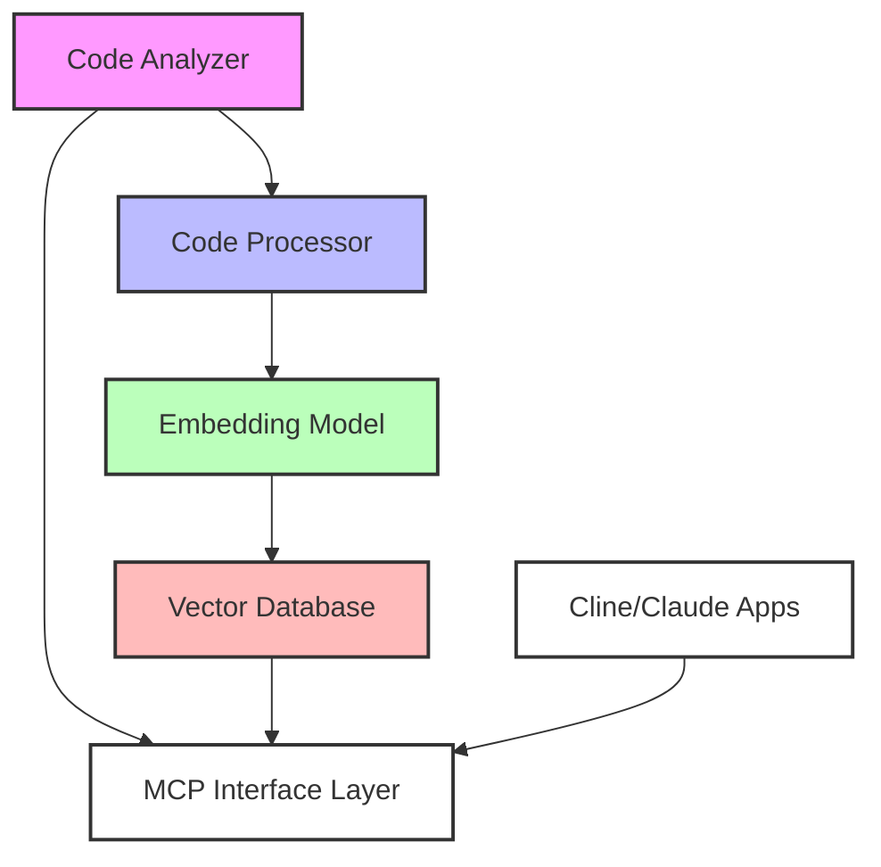
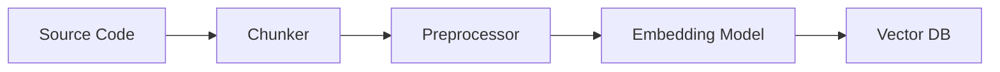

# Technical Design: Vector Database Code Analysis MCP Plugin

## 1. Overview

This design document outlines an architecture for using a vector database to store and query code embeddings, enabling semantic code search and understanding for LLMs. The system chunks code into meaningful segments, generates embeddings, and provides semantic search capabilities through vector similarity.

## 2. System Architecture

### 2.1 High-Level Components



### 2.2 Component Descriptions

1. **Code Analyzer**
   - Manages analysis workflow
   - Coordinates chunking strategy
   - Handles incremental updates
   - Maintains metadata

2. **Code Processor**
   - Chunks code intelligently
   - Extracts context windows
   - Preserves code structure
   - Generates metadata

3. **Embedding Model**
   - Generates code embeddings
   - Uses code-specific models
   - Handles multiple languages
   - Maintains semantic context

4. **Vector Database**
   - Stores code embeddings
   - Enables similarity search
   - Manages metadata
   - Handles versioning

5. **MCP Interface Layer**
   - Exposes vector search via MCP
   - Translates queries to embeddings
   - Formats search results
   - Manages error handling

## 3. Code Processing Pipeline

### 3.1 Chunking Strategy

1. **Structural Chunking**
   - Class-level chunks
   - Method-level chunks
   - Documentation blocks
   - Import/package sections

2. **Context Windows**
   - Sliding windows
   - Overlap for context
   - Metadata preservation
   - Reference tracking

### 3.2 Embedding Generation

1. **Model Selection**
   - CodeBERT for code
   - All-MiniLM-L6-v2 for text
   - Language-specific models
   - Fine-tuned variants

2. **Embedding Features**
   - Code structure
   - Variable names
   - Type information
   - Documentation

### 3.3 Processing Pipeline



## 4. Vector Database Design

### 4.1 Data Model

1. **Vector Storage**
   ```typescript
   interface CodeVector {
     id: string;
     vector: number[];
     metadata: {
       path: string;
       language: string;
       type: "class" | "method" | "doc";
       context: string;
     };
     content: string;
   }
   ```

2. **Metadata Storage**
   ```typescript
   interface CodeMetadata {
     path: string;
     language: string;
     lastModified: Date;
     dependencies: string[];
     references: string[];
   }
   ```

### 4.2 Index Structure

1. **Primary Index**
   - HNSW algorithm
   - Cosine similarity
   - Optimized for code
   - Fast approximate search

2. **Secondary Indices**
   - Path-based lookup
   - Language filtering
   - Type categorization
   - Reference tracking

## 5. MCP Integration

### 5.1 Tools

1. **Semantic Search**
   ```typescript
   interface SemanticQuery {
     query: string;
     language?: string;
     type?: string;
     limit?: number;
     threshold?: number;
   }
   ```

2. **Context Retrieval**
   ```typescript
   interface ContextQuery {
     id: string;
     windowSize?: number;
     includeRefs?: boolean;
   }
   ```

3. **Similarity Analysis**
   ```typescript
   interface SimilarityQuery {
     code: string;
     threshold: number;
     limit?: number;
   }
   ```

### 5.2 Resources

1. **Code Resources**
   - URI Template: `vector://{path}/{type}`
   - Examples:
     - `vector://src/main/MyClass/similar`
     - `vector://src/main/MyClass/context`

2. **Search Resources**
   - URI Template: `search://{query}/{filter}`
   - Examples:
     - `search://authentication/java`
     - `search://error-handling/typescript`

## 6. Query Capabilities

### 6.1 Semantic Search

1. **Natural Language Queries**
   - Find similar code
   - Search by concept
   - Pattern matching
   - Usage examples

2. **Code-Based Queries**
   - Find similar implementations
   - Locate patterns
   - Identify anti-patterns
   - Find related code

### 6.2 Context Analysis

1. **Local Context**
   - Surrounding code
   - Related functions
   - Used variables
   - Type context

2. **Global Context**
   - Project structure
   - Dependencies
   - Usage patterns
   - Common idioms

## 7. Performance Considerations

### 7.1 Indexing Performance

1. **Parallel Processing**
   - Concurrent chunking
   - Batch embeddings
   - Distributed indexing
   - Incremental updates

2. **Optimization Techniques**
   - Chunk caching
   - Embedding caching
   - Batch processing
   - Change detection

### 7.2 Query Performance

1. **Search Optimization**
   - HNSW indexing
   - Approximate search
   - Result caching
   - Query vectorization

2. **Result Ranking**
   - Relevance scoring
   - Context weighting
   - Type boosting
   - Freshness factors

## 8. Implementation Strategy

### 8.1 Phase 1: Foundation

1. **Infrastructure**
   - Setup vector database
   - Configure embedding models
   - Implement chunking
   - Build indexing pipeline

2. **Core Features**
   - Basic embedding
   - Simple search
   - Metadata storage
   - Result retrieval

### 8.2 Phase 2: Enhancement

1. **Advanced Features**
   - Context windows
   - Reference tracking
   - Similarity analysis
   - Pattern matching

2. **Optimization**
   - Performance tuning
   - Caching strategy
   - Index optimization
   - Query refinement

### 8.3 Phase 3: Integration

1. **MCP Integration**
   - Tool implementation
   - Resource endpoints
   - Query translation
   - Result formatting

2. **Validation**
   - Performance testing
   - Accuracy metrics
   - User testing
   - Integration testing

## 9. Advantages

1. **Semantic Understanding**
   - Natural language queries
   - Concept matching
   - Pattern recognition
   - Context awareness

2. **Flexibility**
   - Language agnostic
   - No schema constraints
   - Easy updates
   - Simple scaling

3. **LLM Integration**
   - Direct embedding compatibility
   - Natural queries
   - Semantic search
   - Context retrieval

4. **Performance**
   - Fast similarity search
   - Efficient updates
   - Scalable architecture
   - Low latency queries
